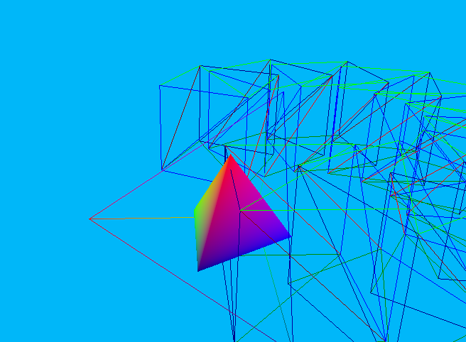

# Cool Vulkan Renderer

Cool Vulkan Renderer (or simply cvr) is a project initially inspired by [raylib](https://github.com/raysan5/raylib), but with a Vulkan twist (i.e. more verbose, less beginner friendly, and overall less feature rich). For now this project is public for my own convenience, however, it might help others interested in C programming with Vulkan. The eventual goal is to make `vk_ctx.h` a proper header-only library, but currently it still has a few dependencies. Note that some examples may have private data because they are for my research; these examples (should) have a little note attached in each folder to let you know the data is private.

## Building from Source on Linux

First, install the dependencies using a package manager e.g.:

```bash
sudo apt install vulkan-tools libvulkan-dev vulkan-validationlayers-dev spirv-tools libxxf86vm-dev libxi-dev
```

Next, we need a shader compiler.
Download glslc from [here](https://github.com/google/shaderc/blob/main/downloads.md) and copy (or symlink) it to your /usr/local/bin.

With the dependencies installed we can now compile the build system.

```bash
cc -o nob nob.c
```

```bash
./nob -h
```

> **__NOTE:__** nob will recompile itself if you make any changes to it. You do not need to run `cc -o nob nob.c` ever again. For more information on nob (short for "no build") see [Musializer](https://github.com/tsoding/musializer/).

## Running an example:
To list available examples run the following:
```bash
./nob -l
```
To build and run an example use the `-e` flag, e.g.:
```bash
./nob -e 3d-primitives
```



Chaining multiple flags can also work, for example here is how to do a clean build and run the example
```bash
./nob -ec 3d-primitives
```
