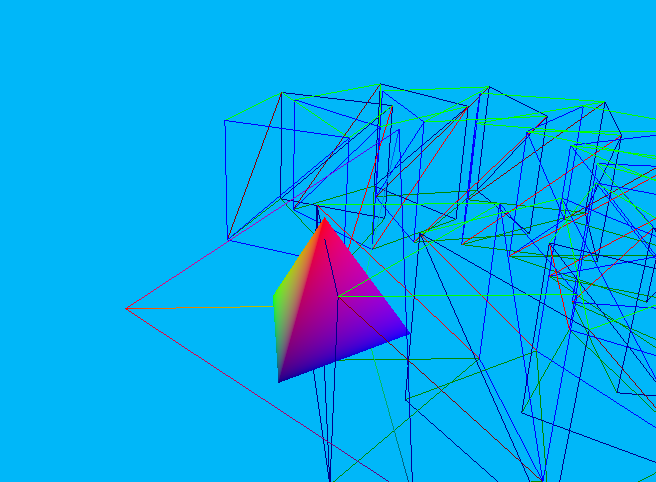

# Cool Vulkan Renderer (Paper Submission Snapshot)

This is a snapshot of the project exactly as it was before submitting the paper. The specific source code used in
the paper can be found [here](examples/arena-point-raster).

## Building from Source on Linux

First, install the dependencies using a package manager e.g.:

```bash
sudo apt install vulkan-tools libvulkan-dev vulkan-validationlayers-dev spirv-tools libxxf86vm-dev libxi-dev
```

Next, we need a shader compiler.
Download glslc from [here](https://github.com/google/shaderc/blob/main/downloads.md) and copy (or symlink) it to your /usr/local/bin.

With the dependencies installed we can now compile the build system.

```bash
cc -o nob nob.c
```

```bash
./nob -h
```

> **__NOTE:__** nob will recompile itself if you make any changes to it. You do not need to run `cc -o nob nob.c` ever again. For more information on nob (short for "no build") see [Musializer](https://github.com/tsoding/musializer/).

## Running an example:
To list available examples run the following:
```bash
./nob -l
```
To build and run an example use the `-e` flag, e.g.:
```bash
./nob -e 3d-primitives
```



Chaining multiple flags can also work, for example here is how to do a clean build and run the example
```bash
./nob -ec 3d-primitives
```
